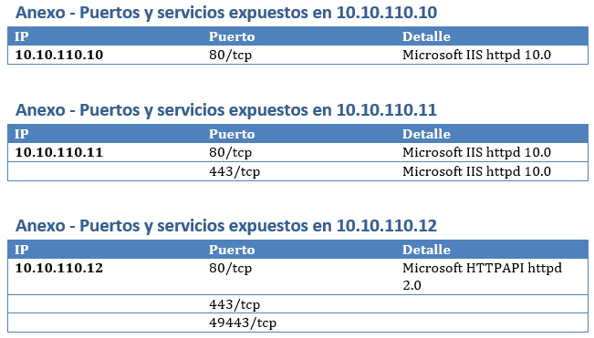

# nmap -> docx
Simple nmap ports XML report parser -> docx

## Results:

## Requeriments
<pre>
pip3 install python-docx
pip3 install python-nmap
</pre>

## Usage
- Unless you follow the same structure, you are only going to use it from POC to adapt it to your own needs

## Download!
- All: https://github.com/nextco/nmap-to-docx/archive/master.zip
